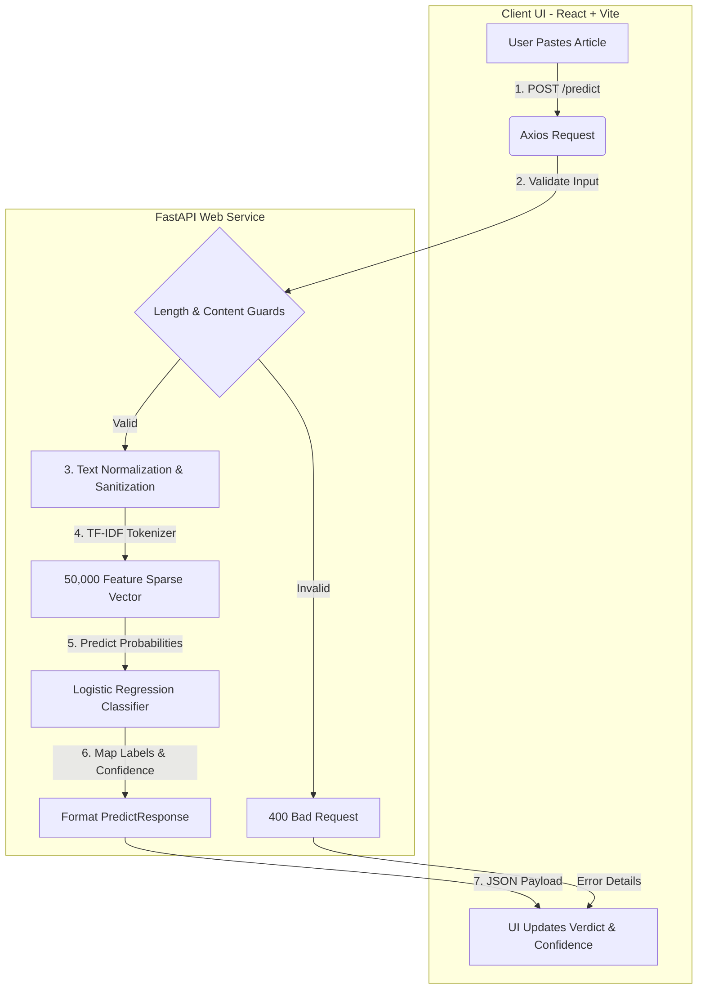

# 📰 Veritas AI — Production-Ready NLP Fake News Sentinel

[](https://veritas-ai-rouge.vercel.app)
[](https://veritas-ai-etx1.onrender.com/docs)
[](#-model-architecture--engineering-trade-offs)
[](https://www.kaggle.com/datasets/clmentbisaillon/fake-and-real-news-dataset)

A full-stack, stateless machine learning application that classifies news articles as **REAL** or **FAKE** in real time. Designed with a focus on production engineering: minimizing resource footprints, optimizing inference speeds, and building a responsive, resilient user experience.

---

## 🏗️ System Architecture & Data Flow

Veritas AI consists of a React frontend built on Vite and a Python REST API powered by FastAPI. The ML pipeline runs completely in-memory, bypassing database queries to achieve sub-millisecond inference.



### Key Engineering Features
* **100% Stateless API**: The web service maintains no state, allowing it to scale horizontally behind load balancers without shared session storage.
* **Cold-Start Preemption**: Free-tier cloud instances go to sleep after inactivity. On initial load, the client proactively pings the `/status` endpoint in the background to spin up the server, showing a warm-up spinner to the user if the server is sleeping.
* **Input Validation & Security**:
  * **Size Guards**: Capped at 20,000 characters to prevent Regular Expression Denial of Service (ReDoS) during cleaning.
  * **Sanitization**: All HTML tags and scripts are stripped to block cross-site scripting (XSS) attempts.
  * **CORS Whitelisting**: The API blocks non-authorized client origins, preventing cross-origin abuse.

---

## 📊 Model Architecture & Engineering Trade-offs

A core design decision in productionizing this model was choosing the right classifier. During the development phase, both **Logistic Regression** and **Random Forest** models were trained on the benchmark **Fake and Real News Dataset** (containing **44,898 articles**).

### Model Metrics Comparison

| Metric | Logistic Regression (Production) | Random Forest (Experimental) | Production Rationale |
| :--- | :---: | :---: | :--- |
| **Accuracy** | **99.39%** | **99.57%** | RF is only `+0.18%` more accurate |
| **ROC-AUC** | **0.9996** | **0.9997** | Negligible variance in classification quality |
| **Model Size** | **~400 KB** (Joblib) | **~400 MB** (Joblib) | **1000x smaller footprint** (extremely cheap memory overhead) |
| **Inference Latency** | **< 1.0 ms** | **~15.0 ms** | 15x faster response on CPU-only hosts |
| **Cold-Start Fetch** | **Fast (< 1s)** | **Slow (10s - 15s)** | LR loads instantly into memory during container spin-up |

### Pipeline Specifications
1. **Text Preprocessing**: The raw text is lowercased, and stripped of URLs, HTML tags, punctuation, numerical digits, and extra spaces.
2. **Feature Extraction**: Done via a `TfidfVectorizer` configured with `ngram_range=(1,2)` (capturing both individual words and word pairs) and restricted to the top **50,000 features** with sublinear TF scaling to normalize document length variations.

---

## 🛠️ Technology Stack

* **Frontend**: React 19, Vite (fast HMR build times), Tailwind CSS v4 (efficient style compiler).
* **Backend**: FastAPI (Python 3.12, native async capabilities, type verification), Uvicorn (ASGI server).
* **Machine Learning**: Scikit-Learn (pipeline), Joblib (efficient serialization).

---

## ⚙️ Local Development Setup

### 1. Clone & Navigate
```bash
git clone https://github.com/DhryXpert/Veritas_AI.git
cd fake-news-detection-nlp
```

### 2. Backend Setup (FastAPI)
```bash
cd backend
python -m venv venv

# Activate Virtual Env (Windows PowerShell)
.\venv\Scripts\Activate.ps1
# Activate Virtual Env (Linux/macOS)
source venv/bin/activate

# Install dependencies (pins scikit-learn to match serialized pipeline)
pip install -r requirements.txt

# Launch Dev Server
python -m uvicorn main:app --reload --port 8000
```
*API docs will be available at [http://localhost:8000/docs](http://localhost:8000/docs).*

### 3. Frontend Setup (React)
```bash
# In a new terminal window
cd frontend
npm install

# Start local server
npm run dev
```
*Frontend runs at [http://localhost:5173](http://localhost:5173). Ensure `frontend/.env` is configured with `VITE_API_URL=http://localhost:8000`.*

---

## 🚀 Deployment

### Backend (Render / Railway)
- **Environment**: Python 3.12 Web Service
- **Build Command**: `pip install -r requirements.txt`
- **Start Command**: `python -m uvicorn main:app --host 0.0.0.0 --port $PORT`
- **Env Variables**:
  - `FRONTEND_URL`: Set to the live Vercel domain to configure CORS permissions.

### Frontend (Vercel)
- **Framework Preset**: Vite
- **Build Command**: `npm run build`
- **Output Directory**: `dist`
- **Env Variables**:
  - `VITE_API_URL`: Points to your live API instance.